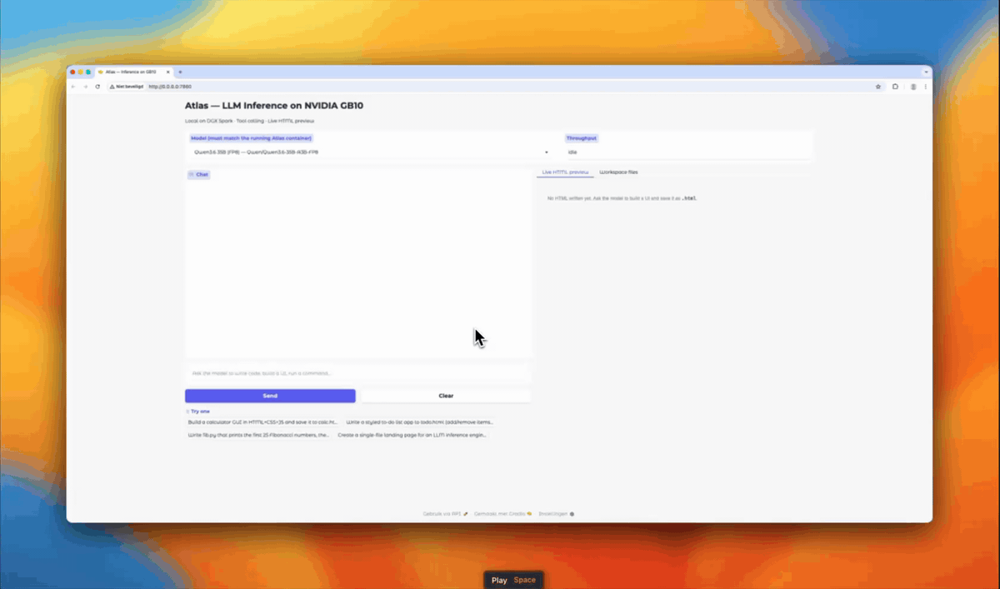
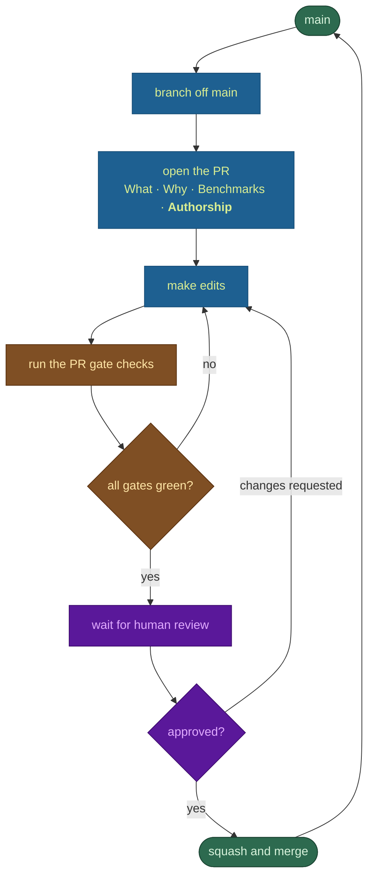
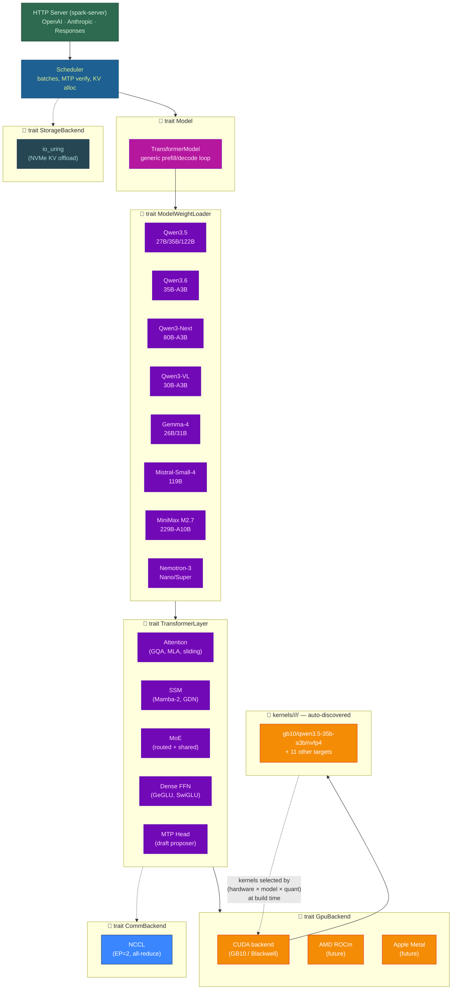

<p align="center">
  
</p>
<p align="center">
  <h1 align="center">Atlas Inference Engine</h1>
  <p align="center">
    <strong>Pure Rust & CUDA LLM Inference</strong><br>
    <em>Universal Inference At Unimaginable Speeds</em>
  </p>
  <p align="center">
    
    
    
  </p>
  <p align="center">
    <a href="LICENSE"></a>
    <a href="#quick-start"></a>
    <a href="https://hub.docker.com/r/azeezish/atlas-gb10:latest"></a>
    <a href="https://discord.com/invite/6vDbKaKrKD"></a>
    <a href="https://x.com/AtlasInference"></a>
  </p>
</p>

<p align="center">
  <a href="assets/atlas-demo.mp4"></a>
</p>

<p align="center">
  <a href="#quick-start"></a>
  <a href="https://atlasinference.dev"></a>
  <a href="https://mlcommons.org/2026/07/mlperf-inference-v61-edge-agentic/"></a>
  <a href="docs/GB10_DEPLOYMENT_GUIDE.md"></a>
</p>

---

## ⚡ What is Atlas?

Atlas is a high-performance, pure Rust & CUDA LLM inference engine purpose-built for prosumer workstations (NVIDIA DGX Spark / GB10 SM121 and AMD Strix Halo). No Python, no PyTorch, no bloated dependency trees—just one compact binary with hand-tuned micro-kernels.

- **Sub-90s First Token**: Boots in seconds with cached weights; zero JIT compile or Python startup lag.
- **Default Flagship Qwen 3.8 27B**: Dense hybrid GDN + Attention running at 23.59 tok/s single-stream with MTP speculative decoding on a single GB10.
- **Nemotron 3.5 Lightning + DSpark**: Full bring-up of hybrid Mamba-2 SSM + MoE paired with DSpark speculative decoding drafters for sub-10ms token decode latencies.
- **Qwen 3.8 Flash-Next Support**: Stream massive ~180B hybrid MoE models inside ~90 GB resident VRAM using direct parallel `pread` NVMe offloading.
- **Turnkey Sparkrun Integration**: Launch any verified model recipe instantly with `sparkrun run @atlas/<recipe>`.
- **OpenAI & Anthropic Compatible**: Drop-in API endpoint supporting streaming, tool calling, and reasoning traces.
- **MLPerf Proven**: Official contributor to the MLPerf Inference v6.1 Edge Agentic benchmark.

---

<a id="philosophy"></a>

## 🧭 Philosophy

The foundation of any given field of science is philosophy. It is that which inspires direction, structure, and mission.

Atlas began as a solution to widely known problem in using other (python) inference engines built by data scientists: the code was steeped in a poly codebase with an ever shifting ecosystem of dependencies, patches, and cross-dependencies. One day your workaround for running a model works, the next day you have to update to a nightly branch of several dependencies and inject a new workaround. This is not how you build a software ecosystem; that's how you build a proof of concept. We thank the great and hard work data scientists made in proving LLMs can revolutionize our world, its economy, and how it challenges us to higher epochs. Now, the software engineers take the torch to turn a proof of concept into something that is designed to withstand the test of time.

### Main Objective

Similar to how llama.cpp was built with the intent to prove you don't need $10000-$100000 GPUs to run LLMs, Atlas is built with the intent to consistently force the narrative that as hardware continues to advance, we should not have to pay premium Cloud API prices for inference. Atlas, by virtue of its philosophy, maximizes speed for each hardware/model combination, thus paving the way for meaningfully powerful and intelligent LLMs to be run locally in such a way the model is truly useful.

### Design Choices

#### Free and Open Source, Always

We promised this since the beginning. We believe great software comes from opening the source, not from just keeping it closed. The more eyes, the better. And therein brings us to the next point.

#### Community-First

For those who've followed us this far since the inception of our Discord, you know the extent to which our commitment to the community is, according to one user humourously put, "cracked". We want to build something incredible, and that means we not only build for you, but you, now having access to the source code, can now build for others in ways that triumph over existing solutions. This is the only way we all win. We are the Pirates of the inference space.

#### Monorepo

We chose a monorepo design to ensure that, as we head further into the agentic age of coding, the average data scientist or engineer can contribute meaningful PRs to any part of the system. Eventually, since this is a monorepo, there will be a day where the repo is autonomously self-improving and self-patching. This is most efficient and most effective when all the code is in one place, not many.

#### Hardware+Model Specific Kernels

We make no compromises or generalizations. Each hardware and model combination has its own unique properties that require fine-tuning custom kernels that leverage the model for that specific hardware configuration. The end result? 2-3x faster kernels all around.

#### AI-Friendly Codebase

It took a significant amount of time to build this codebase. We also know people will want to submit AI-generated PRs. We can't stop you, and in fact, given SOTA, you might just have to! The good news is that this codebase was built with enough railguards, structure, and abstraction to guide your AI to absorb the entire monorepo and contribute meaningfully. There's enough context to keep this going off the rails like a crazy train.This means ultimately that instead of waiting for days to weeks before getting model support, you can just fork this repo, and ask your AI to integrate it, then within hours you'll more likely than not have a working model running. We will not be condescending, [unlike some other inference engines out there when good-faith PRs that simply work are posted](https://github.com/ggml-org/llama.cpp/pull/18680#issuecomment-3723954542). We are not stymied by bureaucracy, and want to enable the community to rapidly expand this monorepo ecosystem safely and effectively.

**AI-authored PRs are the default, and the target.** If you write code by hand,
we ask you to say which parts and why the human beat the AI — not to discourage
you, but because every such case marks a gap in the tooling that we would rather
close than live with. The intent is that the share of hand-written code trends
toward zero. Human-written sections are reviewed by AI to check that claim, and
if the review finds the human was right, that is a result worth keeping.

The contribution loop has exactly two exits — merge, or back to editing:



The per-state commands, exit conditions and the invariants an agent must not
violate are in [`CONTRIBUTING.md`](CONTRIBUTING.md#pull-request-process) — in a
table, because an agent should not have to infer the contract from prose.

#### Theory-Friendly Codebase

Arxiv is getting countless papers published every day on AI. Nobody can keep up. Yet, some papers may be relevant to this project, others may not. Research endeavors to improve quality, alignment, and speed ought to be considered by our community as something we can integrate cleanly. Feel free to open a PoC PR here and just explain what you did and why, and how it works.

#### Plug and Play Design

Our system is modular, with tight abstraction boundaries and trait requirements that force the architecture to take on a certain form. This form is designed to prevent pigeon-holing the project into the wrong direction. The business logic is the same across all hardware/model combinations, just the concrete implementations differ.

<a id="architecture"></a>

## 🏛️ Architecture

The diagram below shows how a single HTTP request flows from the API surface down to hardware-specific CUDA kernel execution. **Dashed borders** mark the **plug-and-play** abstraction boundaries — the traits and registries where a new hardware target, model family, communication backend, or storage backend plugs in without touching the layers above or below it.



### Reading the Diagram

**Solid boxes** are concrete implementations. **Dashed borders with 🔌** are the trait-based abstraction boundaries — each is a Rust trait (or a filesystem convention for kernels) where a new integration plugs in:

| Plug Point | What It Abstracts | To Add New Support |
|---|---|---|
| `trait Model` | Full model forward pass | Rarely needed — the existing `TransformerModel` handles all architectures via composable layers |
| `trait ModelWeightLoader` | HuggingFace → layer translation | **Implement one struct** with weight-name patterns for your model family ([`factory.rs`](crates/spark-model/src/factory.rs) adds one match arm) |
| `trait TransformerLayer` | Per-layer compute (attn, SSM, MoE, FFN) | Compose existing layer types or implement a new one for novel architectures |
| `trait GpuBackend` | All GPU memory and kernel ops | Swap the CUDA driver for another accelerator backend |
| `kernels/<hw>/<model>/<quant>/` | Hardware-tuned CUDA kernels | Drop a new directory with `MODEL.toml` + `.cu` files; `build.rs` auto-discovers it |
| `trait CommBackend` | Multi-GPU collective communication | Implement for MPI, GDR, or custom interconnects |
| `trait StorageBackend` | NVMe KV-cache offload I/O | Implement for CXL, RDMA, or other storage tiers |

### Data Flow Summary

1. **HTTP** → `spark-server` receives OpenAI/Anthropic requests, tokenizes, and enqueues
2. **Scheduler** → batches sequences, orchestrates prefill/decode/speculative-verify steps
3. **Model** → generic loop: `embed → [layer₀ … layerₙ] → norm → lm_head`
4. **Layers** → each layer dispatches through `GpuBackend` to launch kernels from `AtlasRegistry`
5. **Kernels** → pre-compiled PTX selected by `(hardware × model × quant)` target at build time
6. **EP** → `CommBackend` handles cross-GPU all-reduce after MoE expert computation
7. **Storage** → `StorageBackend` spills/restores KV blocks to NVMe for long-context sequences

<a id="models"></a>

## 📦 What We Ship Today

We have to walk before we can run. Today's Atlas is targeted at a single hardware platform — NVIDIA's GB10 (DGX Spark, SM121) — and fifteen hand-tuned (Hardware × Model × Quantization) targets. Every supported model below runs off one multi-model binary; the right kernel set is selected at startup from the model's `config.json`. No swapping images, no rebuilding, no per-model magic — just point Atlas at a HuggingFace ID.

| Family | Model | HuggingFace ID | Params / active | Architecture |
|---|---|---|---:|---|
| Qwen3.5 | Qwen3.5-27B | `Kbenkhaled/Qwen3.5-27B-NVFP4` | 27B dense | Hybrid SSM + attention, dense FFN, MRoPE |
| Qwen3.5 | Qwen3.5-35B-A3B | `Sehyo/Qwen3.5-35B-A3B-NVFP4` | 35B / 3B | GDN + attention + MoE, MTP |
| Qwen3.5 | Qwen3.5-122B-A10B | `Sehyo/Qwen3.5-122B-A10B-NVFP4` | 122B / 10B | GDN + attention + MoE, MTP |
| Qwen3.6 | Qwen3.6-35B-A3B | `Qwen/Qwen3.6-35B-A3B-FP8` | 35B / 3B | GDN + attention + MoE, MRoPE, vision tower |
| Holo-3.1 | Holo-3.1-35B-A3B | `Hcompany/Holo-3.1-35B-A3B-NVFP4` | 35B / 3B | GDN + attention + 256-expert MoE, Qwen3-VL vision |
| Holo-3.1 | Holo-3.1-0.8B | `Hcompany/Holo-3.1-0.8B` | 0.8B dense | GDN + attention + dense FFN, Qwen3-VL vision |
| Ornith | Ornith-1.0-9B | `deepreinforce-ai/Ornith-1.0-9B` | 9B dense | GDN + attention + dense FFN, Qwen3-VL vision, MRoPE |
| Qwen3-Next | Qwen3-Next-80B-A3B | `nvidia/Qwen3-Next-80B-A3B-Instruct-NVFP4` | 80B / 3B | SSM + attention + MoE |
| Qwen3-VL | Qwen3-VL-30B-A3B | `ig1/Qwen3-VL-30B-A3B-Instruct-NVFP4` | 30B / 3B | Vision + attention + MoE |
| Gemma-4 | Gemma-4-26B-A4B | `bg-digitalservices/Gemma-4-26B-A4B-it-NVFP4A16` | 26B / 4B | Attention + MoE, GeGLU |
| Gemma-4 | Gemma-4-31B | `nvidia/Gemma-4-31B-IT-NVFP4` | 31B dense | Attention (sliding + full), GeGLU |
| Mistral | Mistral-Small-4-119B | `mistralai/Mistral-Small-4-119B-2603-NVFP4` | 119B / 6.5B | Attention + MoE |
| MiniMax | MiniMax-M2.7 | `lukealonso/MiniMax-M2.7-NVFP4` | 229B / ~10B | Attention + 256-expert MoE + MTP |
| Nemotron-H | Nemotron-3-Nano-30B-A3B | `nvidia/NVIDIA-Nemotron-3-Nano-30B-A3B-NVFP4` | 30B / 3B | Mamba-2 + attention + MoE |
| Nemotron-H | Nemotron-3-Super-120B-A12B | `nvidia/NVIDIA-Nemotron-3-Super-120B-A12B-NVFP4` | 120B / 12B | Mamba-2 + attention + MoE |

This is a starting point, not a destination. The plug-and-play design above exists precisely so that AMD, Apple Silicon, Intel, and the next round of Blackwell parts can land here as community contributions, and so that the Llama 4s and DeepSeek V4s of next quarter slot in the same way the Qwens did this quarter. We did the hard part — bolting in the abstractions while bringing up the first fifteen targets — so that adding the sixteenth is a weekend, not a quarter.

> **New to Atlas on a Spark?** The [**GB10 Deployment & Compatibility Guide**](docs/GB10_DEPLOYMENT_GUIDE.md) is the one page to read first: which model and quant fit your box and your goal, what to do when it OOMs, the known gotchas, and what "verified" means — then it hands you the exact recipe. If you're deciding *what to run*, start there.

<a id="performance"></a>

## ⚡ Performance

We're not going to spend much real estate on benchmark theatre. The numbers below are what the binary in this repository does on a single NVIDIA GB10, on a short prompt (`"What is the capital of France?"`, `max_tokens ≤ 30`, `temperature = 0.1`), measured end-to-end through the HTTP API. They are reproducible: `scripts/sweep_all_models.sh` is the harness, and the source for every kernel that produced them is in this repository.

| Model | Mode | tok/s |
|---|---|---:|
| Qwen3.5-35B-A3B | MTP speculative (K=2) | **131** |
| Qwen3.5-35B-A3B | turbo4 KV | 77 |
| Qwen3.5-35B-A3B | No speculative | 70 |
| Qwen3-Next-80B-A3B | FP8 KV | 74 |
| Qwen3.5-122B-A10B | EP=2, MTP K=2 (600-tok sustained) | 46 |
| Qwen3.5-122B-A10B | FP8 KV, single-GPU tuned | 32 |
| Qwen3-VL-30B-A3B | NVFP4 KV | 97 |
| Nemotron-3-Nano-30B-A3B | FP8 KV | 88 |
| Nemotron-3-Super-120B | FP8 KV | 24 |
| Gemma-4-26B-A4B | default | 67 |
| Gemma-4-31B | `--max-batch-size 2` | 9 |
| Mistral-Small-4-119B | NVFP4 | 33 |
| Qwen3.5-27B (dense hybrid) | FP8 KV | 13 |

We compete with vLLM and TensorRT-LLM on the same GB10. On Qwen3.5-35B-A3B with MTP speculative decoding, Atlas decodes faster than the same model under NVIDIA's own vLLM build on the same hardware — meaningfully faster, on numbers we can hand you the script for. We will not put a bigger figure in this paragraph than the one that comes off our own benchmark scripts, and we publish the vLLM baseline command alongside ours so you can verify both. If you reproduce a faster vLLM number, file an issue. We would rather be measured than congratulated.

The kernel-by-kernel comparison against PyTorch eager lives in the [benchmarks chapter](book/src/operations/benchmarks.md) along with the methodology footnotes — read them; they matter. That table is **32 benchmark rows over ~11 kernel families** (attention, GEMM, W4A16, MoE, conv1d, GDR, RMSNorm, SiLU×Mul, RoPE), all wins; it is not a sweep of the whole registry. The registry itself is much larger — `kernels/gb10/common/` alone holds 160 `.cu` files defining 318 `extern "C" __global__` entry points, before the per-model shadow directories.

<a id="kv-cache"></a>

## 🗜️ KV Cache Quantization

Atlas stores attention key/value state in a quantized format selected via `--kv-cache-dtype`. Lower bit-widths fit more tokens in GPU memory at the cost of precision; the Turbo family adds Walsh-Hadamard rotation and Lloyd-Max optimal codebooks to recover accuracy at the same bit rate. Mix dtypes per layer with `--kv-high-precision-layers` to keep boundary layers at BF16 while compressing the middle.

The table below is the **symmetric** set — the same format for K and V. `KvCacheDtype` (`crates/spark-runtime/src/kv_cache.rs`) accepts **16 values in total**: the six below plus `turbo2` (2-bit) and nine TurboQuant+ **asymmetric** K/V pairings (`turbo4k_turbo3v`, `turbo4k_turbo8v`, `turbo3k_turbo8v`, `bf16k_turbo4v`, `bf16k_turbo3v`, `bf16k_turbo2v`, `fp8k_turbo4v`, `fp8k_turbo3v`, `fp8k_turbo2v`) that store K at higher precision than V, since K dominates attention-score fidelity. Those are documented in [`docs/turboquant-plus.md`](docs/turboquant-plus.md); the parser is the authority on the accepted spelling.

| CLI flag | Bits/element | Scale overhead | Technique | When to use |
|---|---:|---|---|---|
| `bf16` | 16 | — | Raw BF16 storage | Maximum precision; short-context or quality-critical workloads |
| `fp8` | 8 | Per-tensor FP32 scale (from checkpoint or online calibration via `--fp8-kv-calibration-tokens`) | FP8 E4M3 with static or calibrated per-tensor scale | **Default.** Safe baseline — half the memory of BF16, minimal quality loss for most models |
| `turbo8` | 8 | Per-group BF16 scale (2 bytes / 16 elements) | Walsh-Hadamard rotation → FP8 E4M3 + BF16 per-group scales | FP8-level memory with outlier suppression; recommended for many-layer models (e.g. MiniMax M2.7, 58 layers) where per-group FP8 scales compound |
| `nvfp4` | 4 | Per-group FP8 scale (1 byte / 16 elements) | E2M1 packed nibbles (NVIDIA NVFP4 format) | 4× compression vs BF16; good for long-context with `--kv-high-precision-layers auto` |
| `turbo4` | 4 | Per-group FP8 scale (1 byte / 16 elements) | Walsh-Hadamard rotation → Lloyd-Max optimal 4-bit codebook | ~2× lower MSE than NVFP4 at the same bit rate; same memory footprint |
| `turbo3` | 3 | Per-group FP8 scale (1 byte / 16 elements) | Walsh-Hadamard rotation → Lloyd-Max 3-bit codebook (8 levels, packed 8 values → 3 bytes) | Maximum compression (22% smaller than turbo4); experimental |

<a id="quick-start"></a>

## 🚀 Quick Start

### 1. Default Flagship: Qwen 3.8 27B (Dense) via Sparkrun

The default flagship recipe deploys Qwen 3.8 27B in NVFP4 on a single GB10 with native MTP speculative decoding:

```bash
# Step 1: Install sparkrun
pip install sparkrun  # or: uvx sparkrun setup install

# Step 2: Download weights (or let sparkrun fetch automatically)
huggingface-cli download unsloth/Qwen3.8-27B-NVFP4 \
  --local-dir ~/.cache/huggingface/hub/models--unsloth--Qwen3.8-27B-NVFP4

# Step 3: Launch service (port 8888)
sparkrun run @atlas/qwen3.8-27b-nvfp4 --hosts localhost
```

Prefer the one-line quickstart script?
```bash
curl -fsSL https://atlasinference.dev/quickstart.sh | sh
```

### 2. Nemotron 3.5 Lightning 30B + DSpark Speculative Drafter

Pairs the hybrid Mamba-2 + Attention + MoE backbone with NVIDIA's 6-layer DSpark drafter (gamma=4 / K=3 verify) for sub-10ms token generation:

```bash
# Export recommended performance environment
export ATLAS_DFLASH_OPTION_B=1
export ATLAS_NO_TOOL_INJECT=1   # +15.58 BFCL accuracy boost

# Launch Nemotron 3.5 Lightning with DSpark
sparkrun run @atlas/nemotron-3.5-lightning-30b-a3b-nvfp4-dspark --hosts localhost
```

### 3. Qwen 3.8 Flash-Next (~180B Hybrid MoE)

Atlas dynamically streams the 47.7 GB PLE n-gram table off NVMe using parallel `pread` workers, keeping peak resident memory under 90 GB on a single 128 GB GB10:

```bash
huggingface-cli download RadixArk/Qwen3.8-Flash-Next-NVFP4 \
  --local-dir ~/.cache/huggingface/hub/models--RadixArk--Qwen3.8-Flash-Next-NVFP4

sparkrun run @atlas/qwen3.8-flash-next-nvfp4 --hosts localhost
```

### 4. AMD Strix Halo (gfx1151) Quick Start

Atlas converts CUDA sources natively to AMD RDNA 3.5. Bring-up is active across two dedicated branches:

- **Linux Leg (Ubuntu 24.04 / ROCm 6.2+)**: Branch [`port/qwen3.8-strix-linux`](https://github.com/Atlas-Inf/atlas/tree/port/qwen3.8-strix-linux) ([PR #8](https://github.com/Atlas-Inf/atlas/pull/8))
- **Windows Leg (DirectX 12 / native MSVC)**: Branch [`port/qwen3.8-windows`](https://github.com/Atlas-Inf/atlas/tree/port/qwen3.8-windows) ([PR #9](https://github.com/Atlas-Inf/atlas/pull/9))

No container on this one — Strix Halo is a unified-memory APU, and the validated path is the native binary built against ROCm (`/opt/rocm`) with hipcc. Two scripts in the repo root carry the whole thing:

```bash
# Clone the AMD Strix Halo port branch (until PR #8 lands on main)
git clone -b port/qwen3.8-strix-linux https://github.com/Atlas-Inf/atlas.git
cd atlas

# Build once — strix-hip backend (default), all kernel targets, no SCALE or
# RDMA prerequisites. Needs ROCm + cargo, nothing else.
./build-amd.sh

# Serve — defaults are the validated configuration: K=4 MTP speculative
# decode, the default-on W4A8 DP4A decode arm, BF16 KV.
./serve-amd.sh                              # nvidia/Qwen3.8-27B-NVFP4
./serve-amd.sh unsloth/Qwen3.8-27B-NVFP4    # or the preservation checkpoint
```

Measured on AzeezStrix (Ryzen AI Max+ 395 / Radeon 8060S, ROCm 7.13, ~60 GB GTT): **28.3–28.6 tok/s** K=4 decode, 13.3–13.6 tok/s at 30k context, and **83.02 / 80.41** (overall / normalized) on the 995-row bfcl-subset golden draw — no accuracy regression vs the NVIDIA shipped reference (83.22 / 79.02). Details: [`kernels/strix-hip/qwen3.8-27b/BENCH.toml`](kernels/strix-hip/qwen3.8-27b/BENCH.toml), [`docs/porting/amd-strix-halo-scale.md`](docs/porting/amd-strix-halo-scale.md).

Knobs (env-overridable, sane defaults):

- `NUM_DRAFTS=0` — disables speculative decode (reproduces the frozen non-spec accuracy recipe; default `3` = the measured K=4 arm).
- `MAX_SEQ_LEN` / `GPU_UTIL` / `PORT` — sizing knobs (defaults 4096 / 0.88 / 8081; the unified-memory ceiling is ~55 GB usable).
- `LM_HEAD=bf16` — switch for the unsloth preservation checkpoint (its lm_head ships per-row FP8). The default `nvfp4` is the NVIDIA checkpoint's measured decode lever.
- `ATLAS_W4A16_DP4A=0` — opt-out of the DP4A decode arm (on by default; accuracy-validated).
- The FP8-preservation exports (`ATLAS_FP8_DEQUANT_*`, `ATLAS_GDN_BF16_WEIGHTS`) are baked into the script — required for the unsloth checkpoint's per-row-FP8 projections, no-op elsewhere. Don't strip them.

### Hitting the Endpoint

Atlas speaks OpenAI, Anthropic, and Responses APIs on the same port. `curl`, the OpenAI SDK, Open WebUI, opencode, Cline, Claude Code — point them at the served port (`sparkrun` recipes default to 8888; `serve-amd.sh` defaults to 8081):

```bash
curl http://localhost:8888/v1/chat/completions \
  -H "Content-Type: application/json" \
  -d '{
    "model": "atlas",
    "messages": [{"role": "user", "content": "Explain quantum computing in three sentences."}],
    "max_tokens": 256
  }'
```

---

## 📦 Verified Model Recipes

Every recipe is maintained in the [sparkrun-recipes](https://github.com/Atlas-Inf/sparkrun-recipes) SSOT repository and verified against committed gate baselines:

| Vendor | Family | Model Recipe | Quant | Topology | Highlights |
|---|---|---|---|:---:|---|
| **Qwen** | **Qwen3.8** | `@atlas/qwen3.8-27b-nvfp4` | NVFP4 | Single GB10 | **Default Flagship**. Dense hybrid GDN + Attn, MTP spec decode, FP8 KV, 23.59 tok/s |
| **Qwen** | **Qwen3.8** | `@atlas/qwen3.8-27b-nvfp4-latency` | NVFP4 | Single GB10 | Low-concurrency / interactive profile tuned for minimal single-stream latency |
| **Qwen** | **Qwen3.8** | `@atlas/qwen3.8-27b-nvfp4-throughput` | NVFP4 | Single GB10 | Concurrency profile beating vLLM from 1 to 128 streams on GB10 |
| **Nemotron** | **Nemotron-3.5** | `@atlas/nemotron-3.5-lightning-30b-a3b-nvfp4-dspark` | NVFP4 | Single GB10 | **New**. Hybrid Mamba-2 SSM + MoE with 1.3 GB DSpark drafter (K=3 verify) |
| **Nemotron** | Nemotron-3 | `@atlas/nemotron-3-nano-30b-a3b-nvfp4` | NVFP4 | Single GB10 | 30B / 3B active Mamba-2 + MoE |
| **Nemotron** | Nemotron-3 | `@atlas/nemotron-3-super-120b-a12b-nvfp4` | NVFP4 | Single GB10 | 120B / 12B active hybrid architecture |
| **Qwen** | **Qwen3.8** | `@atlas/qwen3.8-flash-next-nvfp4` | NVFP4 | Single GB10 | ~180B hybrid MoE, 8K context, parallel `pread` NVMe offload (750–800 tok/s prefill, 36.7 tok/s decode, ~90 GB resident) |
| **Qwen** | **Qwen3.8** | `@atlas/qwen3.8-flash-next-nvfp4-throughput` | NVFP4 | Single GB10 | Throughput-tuned 8K context profile |
| **Qwen** | Qwen3.6 | `@atlas/qwen3.6-35b-a3b-fp8-mtp` | FP8 | Single GB10 | 35B / 3B active GDN + MoE + vision, MTP speculative |
| **Gemma** | Gemma-4 | `@atlas/gemma-4-26b-a4b-nvfp4` | NVFP4 | Single GB10 | 26B / 4B active MoE with GeGLU |
| **DeepSeek** | DeepSeek-V4 | `@atlas/deepseek-v4-flash-nvfp4-ep2` | NVFP4 | EP=2 (2 Sparks) | Dual-node Expert Parallelism |

Browse the interactive recipe browser at [atlasinference.dev/#models](https://atlasinference.dev/#models).

---

## 🏛️ Engine Architecture & Innovations

- **Double-Buffered Mamba-2 Chunked Scans**: Hand-tuned SM121 PTX kernels delivering an 8.4x prefill latency reduction over generic vLLM implementations.
- **Native FP4 Tensor Core Prefill GEMMs**: Direct execution in Blackwell NVFP4 precision without dequantization overhead.
- **PLE N-Gram NVMe Streaming (Direct Parallel `pread` vs. `mmap`)**: Traditional engines (like baseline llama.cpp) suffer from thousands of scattered 4KB `mmap` page faults for tiny ~90-byte rows, stalling prefill at ~300 tok/s. Atlas implements an asynchronous `O_DIRECT` worker pool (`ATLAS_PLE_FAULT_THREADS=32`) using parallel `pread` directly off NVMe storage (similar to the optimization in llama.cpp PR #28136). This delivers **750–800 tok/s cold prefill** on DGX Spark (2.5x faster) and +20–32% on Strix Halo 128GB, completely bypassing OS page-cache faults while keeping the entire 47.7 GB n-gram table off RAM/VRAM.
- **Recurrent State Checkpoint & Rollback**: Enables multi-token speculative decoding with DSpark on recurrent state models (Mamba-2 / GDN) without state divergence.
- **TurboQuant+ KV Cache**: Symmetric and asymmetric KV quantization (`bf16`, `fp8`, `nvfp4`, `turbo4`) with Randomized Hadamard Rotation and Lloyd-Max codebooks.

### KV Cache Options

| Flag | Bits/elem | Storage | Description |
|---|---:|---|---|
| `--kv-cache-dtype bf16` | 16 | BF16 | Uncompressed baseline. Recommended for short-context or high-precision needs. |
| `--kv-cache-dtype fp8` | 8 | FP8 E4M3 | **Default**. Halves memory with minimal quality degradation across all benchmarks. |
| `--kv-cache-dtype nvfp4` | 4 | E2M1 | 4x compression vs BF16. Excellent for long context windows. |
| `--kv-cache-dtype turbo4` | 4 | E2M1 + WHT | ~2x lower reconstruction MSE than standard NVFP4 via Lloyd-Max codebooks. |

---

## 🤝 Community & Support

- **Website**: [atlasinference.dev](https://atlasinference.dev)
- **Discord**: [Join our Discord](https://discord.com/invite/6vDbKaKrKD) — Active daily development, live kernel tuning, and model requests.
- **Recipes Repository**: [Atlas-Inf/sparkrun-recipes](https://github.com/Atlas-Inf/sparkrun-recipes)
- **Deployment Guide**: [GB10 Deployment Guide](docs/GB10_DEPLOYMENT_GUIDE.md)

---

## ⚖️ Dual License

- **Community Edition**: Licensed under **AGPLv3**. Free and open for personal use, research, and non-commercial local deployments.
- **Enterprise Edition**: Commercial licensing for proprietary applications, SaaS hosting without AGPLv3 copyleft obligations, dedicated support, and custom hardware/kernel porting. Contact `debaterishaqui@gmail.com`.

<sub><b>Continuity notice.</b> Atlas is continuing. This repository, the <a href="https://github.com/Atlas-Inf">Atlas-Inf</a> GitHub organization, and <a href="https://atlasinference.dev">atlasinference.dev</a> are the replacement official Atlas channels. The existing website and GitHub repository remain disputed Atlas assets that have not been relinquished.</sub>
