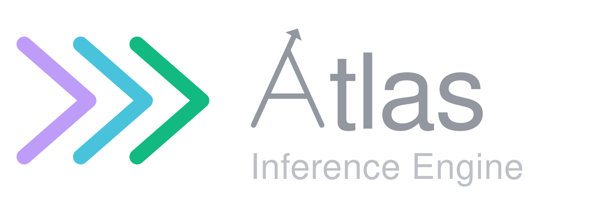

<p align="center">
  
</p>
<p align="center">
  <h1 align="center">Atlas Inference Engine</h1>
  <p align="center">
    <strong>Pure Rust & CUDA LLM Inference</strong><br>
    <em>Universal Inference At Unimaginable Speeds</em>
  </p>
  <p align="center">
    
    
    
  </p>
  <p align="center">
    <a href="LICENSE"></a>
    <a href="#quick-start"></a>
    <a href="https://hub.docker.com/r/azeezish/atlas-gb10:latest"></a>
    <a href="https://discord.com/invite/6vDbKaKrKD"></a>
    <a href="https://x.com/AtlasInference"></a>
  </p>
</p>

<p align="center">
  <a href="#quick-start"></a>
  <a href="https://atlasinference.dev"></a>
</p>

---

## ⚡ What is Atlas?

Atlas is a high-performance, pure Rust & CUDA LLM inference engine purpose-built for prosumer workstations (NVIDIA DGX Spark / GB10 SM121 and AMD Strix Halo). No Python, no PyTorch, no bloated dependency trees—just one compact binary with hand-tuned micro-kernels.

- **Sub-90s First Token**: Boots in seconds with cached weights; zero JIT compile or Python startup lag.
- **Default Flagship Qwen 3.8 27B**: Dense hybrid GDN + Attention running at 23.59 tok/s single-stream with MTP speculative decoding on a single GB10.
- **Qwen 3.8 Flash-Next Support**: Stream massive ~180B hybrid MoE models inside ~90 GB resident VRAM using NVMe PLE n-gram table offloading.
- **Nemotron 3.5 Lightning + DSpark**: Full bring-up of hybrid Mamba-2 SSM + MoE paired with DSpark speculative decoding drafters for sub-10ms token decode latencies.
- **Turnkey Sparkrun Integration**: Launch any verified model recipe instantly with `sparkrun run @atlas/<recipe>`.
- **OpenAI & Anthropic Compatible**: Drop-in API endpoint supporting streaming, tool calling, and reasoning traces.
- **MLPerf Proven**: Official contributor to the MLPerf Inference v6.1 Edge Agentic benchmark.

---

## 🚀 Quick Start

### 1. Default Flagship: Qwen 3.8 27B via Sparkrun

The default flagship recipe deploys Qwen 3.8 27B in NVFP4 on a single GB10 with native MTP speculative decoding:

```bash
# Step 1: Install sparkrun
pip install sparkrun  # or: uvx sparkrun setup install

# Step 2: Download weights (or let sparkrun fetch automatically)
huggingface-cli download unsloth/Qwen3.8-27B-NVFP4 \
  --local-dir ~/.cache/huggingface/hub/models--unsloth--Qwen3.8-27B-NVFP4

# Step 3: Launch service (port 8888)
sparkrun run @atlas/qwen3.8-27b-nvfp4 --hosts localhost
```

Prefer the one-line quickstart script?
```bash
curl -fsSL https://atlasinference.dev/quickstart.sh | sh
```

### 2. Qwen 3.8 Flash-Next (~180B Hybrid MoE)

Atlas dynamically streams the 47.7 GB PLE n-gram table off NVMe, keeping peak resident memory under 90 GB on a single 120 GB GB10:

```bash
huggingface-cli download RadixArk/Qwen3.8-Flash-Next-NVFP4 \
  --local-dir ~/.cache/huggingface/hub/models--RadixArk--Qwen3.8-Flash-Next-NVFP4

sparkrun run @atlas/qwen3.8-flash-next-nvfp4 --hosts localhost
```

### 3. Nemotron 3.5 Lightning 30B + DSpark Speculative Drafter

Pairs the hybrid Mamba-2 + Attention + MoE backbone with NVIDIA's 6-layer DSpark drafter (gamma=4 / K=3 verify) for ultra-low latency token generation:

```bash
# Export recommended performance environment
export ATLAS_DFLASH_OPTION_B=1
export ATLAS_NO_TOOL_INJECT=1   # +15.58 BFCL accuracy boost

# Launch Nemotron 3.5 Lightning with DSpark
sparkrun run @atlas/nemotron-3.5-lightning-30b-a3b-nvfp4-dspark --hosts localhost
```

### 4. Querying the Endpoint

Atlas serves an OpenAI-compatible API on the designated port:

```bash
curl http://localhost:8888/v1/chat/completions \
  -H "Content-Type: application/json" \
  -d '{
    "model": "atlas",
    "messages": [{"role": "user", "content": "Explain quantum computing in three sentences."}],
    "max_tokens": 256
  }'
```

---

## 📦 Verified Model Recipes

Every recipe is maintained in the [sparkrun-recipes](https://github.com/Atlas-Inf/sparkrun-recipes) SSOT repository and verified against committed gate baselines:

| Vendor | Family | Model Recipe | Quant | Topology | Highlights |
|---|---|---|---|:---:|---|
| **Qwen** | **Qwen3.8** | `@atlas/qwen3.8-27b-nvfp4` | NVFP4 | Single GB10 | **Default Flagship**. Dense hybrid GDN + Attn, MTP spec decode, FP8 KV, 23.59 tok/s |
| **Qwen** | **Qwen3.8** | `@atlas/qwen3.8-27b-nvfp4-latency` | NVFP4 | Single GB10 | Low-concurrency / interactive profile tuned for minimal single-stream latency |
| **Qwen** | **Qwen3.8** | `@atlas/qwen3.8-27b-nvfp4-throughput` | NVFP4 | Single GB10 | Concurrency profile beating vLLM from 1 to 128 streams on GB10 |
| **Qwen** | **Qwen3.8** | `@atlas/qwen3.8-flash-next-nvfp4` | NVFP4 | Single GB10 | ~180B hybrid MoE, 8K context, parallel `pread` NVMe offload (750–800 tok/s prefill, 36.7 tok/s decode, ~90 GB resident) |
| **Qwen** | **Qwen3.8** | `@atlas/qwen3.8-flash-next-nvfp4-throughput` | NVFP4 | Single GB10 | Throughput-tuned 8K context profile |
| **Nemotron** | **Nemotron-3.5** | `@atlas/nemotron-3.5-lightning-30b-a3b-nvfp4-dspark` | NVFP4 | Single GB10 | **New**. Hybrid Mamba-2 SSM + MoE with 1.3 GB DSpark drafter (K=3 verify) |
| **Nemotron** | Nemotron-3 | `@atlas/nemotron-3-nano-30b-a3b-nvfp4` | NVFP4 | Single GB10 | 30B / 3B active Mamba-2 + MoE |
| **Nemotron** | Nemotron-3 | `@atlas/nemotron-3-super-120b-a12b-nvfp4` | NVFP4 | Single GB10 | 120B / 12B active hybrid architecture |
| **Qwen** | Qwen3.6 | `@atlas/qwen3.6-35b-a3b-fp8-mtp` | FP8 | Single GB10 | 35B / 3B active GDN + MoE + vision, MTP speculative |
| **Gemma** | Gemma-4 | `@atlas/gemma-4-26b-a4b-nvfp4` | NVFP4 | Single GB10 | 26B / 4B active MoE with GeGLU |
| **DeepSeek** | DeepSeek-V4 | `@atlas/deepseek-v4-flash-nvfp4-ep2` | NVFP4 | EP=2 (2 Sparks) | Dual-node Expert Parallelism |

Browse the interactive recipe browser at [atlasinference.dev/#models](https://atlasinference.dev/#models).

---

## 🏛️ Engine Architecture & Innovations

- **Double-Buffered Mamba-2 Chunked Scans**: Hand-tuned SM121 PTX kernels delivering an 8.4x prefill latency reduction over generic vLLM implementations.
- **Native FP4 Tensor Core Prefill GEMMs**: Direct execution in Blackwell NVFP4 precision without dequantization overhead.
- **PLE N-Gram NVMe Streaming (Direct Parallel `pread` vs. `mmap`)**: Traditional engines (like baseline llama.cpp) suffer from thousands of scattered 4KB `mmap` page faults for tiny ~90-byte rows, stalling prefill at ~300 tok/s. Atlas implements an asynchronous `O_DIRECT` worker pool (`ATLAS_PLE_FAULT_THREADS=32`) using parallel `pread` directly off NVMe storage (similar to the optimization in llama.cpp PR #28136). This delivers **750–800 tok/s cold prefill** on DGX Spark (2.5x faster) and +20–32% on Strix Halo 128GB, completely bypassing OS page-cache faults while keeping the entire 47.7 GB n-gram table off RAM/VRAM.
- **Recurrent State Checkpoint & Rollback**: Enables multi-token speculative decoding with DSpark on recurrent state models (Mamba-2 / GDN) without state divergence.
- **TurboQuant+ KV Cache**: Symmetric and asymmetric KV quantization (`bf16`, `fp8`, `nvfp4`, `turbo4`) with Randomized Hadamard Rotation and Lloyd-Max codebooks.

### KV Cache Options

| Flag | Bits/elem | Storage | Description |
|---|---:|---|---|
| `--kv-cache-dtype bf16` | 16 | BF16 | Uncompressed baseline. Recommended for short-context or high-precision needs. |
| `--kv-cache-dtype fp8` | 8 | FP8 E4M3 | **Default**. Halves memory with minimal quality degradation across all benchmarks. |
| `--kv-cache-dtype nvfp4` | 4 | E2M1 | 4x compression vs BF16. Excellent for long context windows. |
| `--kv-cache-dtype turbo4` | 4 | E2M1 + WHT | ~2x lower reconstruction MSE than standard NVFP4 via Lloyd-Max codebooks. |

---

## 🤝 Community & Support

- **Website**: [atlasinference.dev](https://atlasinference.dev)
- **Discord**: [Join our Discord](https://discord.com/invite/6vDbKaKrKD) — Active daily development, live kernel tuning, and model requests.
- **Recipes Repository**: [Atlas-Inf/sparkrun-recipes](https://github.com/Atlas-Inf/sparkrun-recipes)
- **Deployment Guide**: [GB10 Deployment Guide](docs/GB10_DEPLOYMENT_GUIDE.md)

---

## ⚖️ Dual License

- **Community Edition**: Licensed under **AGPLv3**. Free and open for personal use, research, and non-commercial local deployments.
- **Enterprise Edition**: Commercial licensing for proprietary applications, SaaS hosting without AGPLv3 copyleft obligations, dedicated support, and custom hardware/kernel porting. Contact `debaterishaqui@gmail.com`.

<sub><b>Continuity notice:</b> Atlas is continuing. This repository, the <a href="https://github.com/Atlas-Inf">Atlas-Inf</a> GitHub organization, and <a href="https://atlasinference.dev">atlasinference.dev</a> are the official Atlas channels.</sub>
